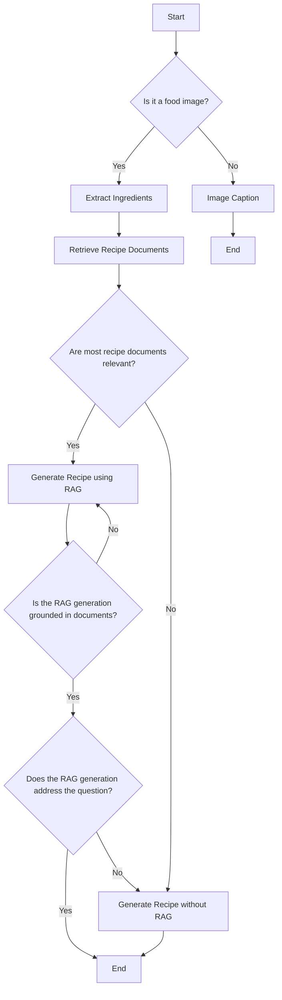

# Photo to Recipe generation with Multi-agents

This project leverages generative AI agents to generate recipes from food images. By utilizing various tools and workflows, the application can extract ingredients, retrieve relevant documents, and generate detailed recipes. The project is crated with Langchain/Langgraph and can be ran with docker compose

To run this project, you only need to use Docker Compose. Follow the steps below to get started.

## Prerequisites
- Nvidia API key is provided through .env file
- Ensure you have Docker and Docker Compose installed on your machine.

## Steps to Run

1. **Clone the Repository**:
```sh
git clone git@github.com:ttback/photo-to-recipe.git
cd <repository-directory>
```

2. **Set up NVIDIA_API_KEY key** in .env file, see .env.example

3. **Build and Run the Docker Containers**:
```sh
docker compose up
```

4. ***Run it in browser***:
localhost:7860

The images in imges folder can be used to test out basic workflow with burger, sushi and non-food photo from Nvidia example for image caption.


## Diagram


