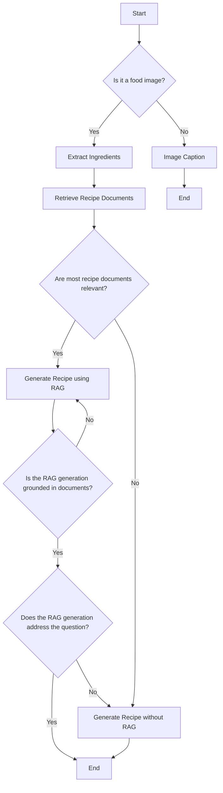

# Photo to Recipe generation with Multi-agents

This project leverages generative AI agents to generate recipes from food images. By utilizing ️LangGraph, various LLM-powered tools and conditional workflows, the application can extract ingredients, retrieve relevant documents, generate recipes, and have self-supervision agents to correct mistakes and errors in generation.  

### Related Papers
- **Routing:** Adaptive RAG ([paper](https://arxiv.org/abs/2403.14403)). Route questions to different type of retrieval 
- **Self-correction:** Self-RAG ([paper](https://arxiv.org/abs/2310.11511)). Fix answers that either contain hallucinations or don't answer the question

### Credits and Inspiration
1. [NVIDIA/GenerativeAIExamples](https://github.com/NVIDIA/GenerativeAIExamples/tree/main)
2. [Agent_use_tools_leveraging_NVIDIA_AI_endpoints.ipynb](https://github.com/NVIDIA/GenerativeAIExamples/blob/main/notebooks/04_Agent_use_tools_leveraging_NVIDIA_AI_endpoints.ipynb)
3. [LangChain NVIDIA Integration](https://github.com/langchain-ai/langchain-nvidia/tree/main)

## How to Run 
The project is created with Langchain/Langgraph and can be run with `docker compose`

To run this project, you only need to use Docker Compose. Follow the steps below to get started.

## Prerequisites
- Nvidia API key is provided through .env file
- Ensure you have Docker and Docker Compose installed on your machine.

## Steps to Run

1. **Clone the Repository**:
```sh
git clone git@github.com:ttback/photo-to-recipe.git
cd <repository-directory>
```

2. **Set up NVIDIA_API_KEY key** in .env file, see .env.example

3. **Build and Run the Docker Containers**:
```sh
docker compose up
```

4. ***Run it in browser***:
localhost:7860

The images in images folder can be used to test out basic workflow with burger, sushi and non-food photo from the Nvidia example for image caption.
The vector db contains burger recipes only, so sushi can be used to test for most complete workflow where the initial RAG-based generation will be rejected and the ADDA team will re-generate recipe with non-RAG based process. 

## Key Multi-agent Features
1. **Unsupervised Image Type detection**: Handle food vs. non-food image without user interaction
2. **Automatic Ingredient Extraction from Food Photo**: Using latest multi-modal SLM (`microsoft/phi-3-vision-128k-instruct`) to extract ingredient from food image
3. **Document Retrieval**: Transform online web pages to vector store via langchain and Nvidia's embedding model, `NV-Embed-QA`
4. **Conditional RAG or no-RAG generation**: Check whether the retrieved documents are relevant for the recipe generation process, before proceeding with RAG-based generation. If for some reasons, the web urls changed content, or are unavailable, ADDA team is smart enough to avoid RGA-based generation
5. **RAG-based recipe generation**: Using retrieved documents, the writer agent will generate recipe.
6. **Automated Hallucation checker**: Agents will check whether generated recipe is grounded by documents and is for the food and ingredients detected in the input image.

## AI Agents and LLM power tools

| Image                                                                 | Role      | Description                | Tools       |
|-----------------------------------------------------------------------|-----------|----------------------------|-------------|
|  | Reader    | Reads content              | <ul><li>image_router</li><li>ingredients_recognizer</li><li>image_caption</li></ul>        |
|  | Searcher  | Searches for information   | <ul><li>doc_retriever</li><li>relevance_grader</li></ul>    |
|  | Writer    | Writes Recipe             | <ul><li>rag_recipe_generator</li><li>recipe_generator</li></ul>  |
|  | Reviewer  | Reviews content            | <ul><li>hallucination_grader</li><li>answer_grader</li></ul>     |

## Tools

| Tool                        | Description                                                                 | Model                          |
|-----------------------------|-----------------------------------------------------------------------------|-------------------------------|
| `image_router`               | Routes the image to the appropriate processing path based on its content.   | `microsoft/phi-3-vision-128k-instruct`                           |
| `ingredients_recognizer`       | Extracts ingredients from the image.                                         | `microsoft/phi-3-vision-128k-instruct`                           |
| `image_caption`             | Generates a caption for the image.                                           | `microsoft/phi-3-vision-128k-instruct`                           |
| `doc_retriever`                  | Retrieves documents from a vector store based on the question, downloading from food.com.               | `NV-Embed-QA`                           |
| `relevance_grader`           | Grades the relevance of retrieved documents to the question.                 | `meta/llama3-70b-instruct`                           |
| `rag_recipe_generator`      | Generates a recipe using RAG on retrieved documents.                         | `meta/llama3-70b-instruct`    |
| `recipe_generator`          | Generates a recipe without using RAG.                                        | `mistralai/mixtral-8x7b-instruct-v0.1`                           |
| `hallucination_grader`      | Grade for hallucinations in the generated recipe.                           | meta/llama3-70b-instruct                           |
| `answer_grader` | Grades the generated recipe against the documents and question. | `meta/llama3-70b-instruct`                           |


## Diagram


