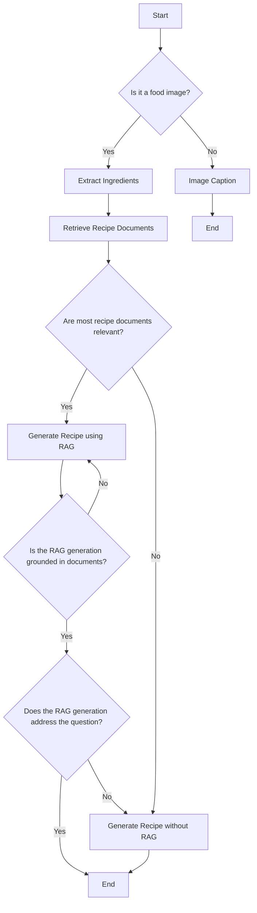

```mermaid
graph TD
    A[Start] --> B{Is it a food image?}
    B -->|Yes| C[Extract Ingredients]
    B -->|No| D[Image Caption]
    C --> E[Retrieve Recipe Documents]
    E --> F{Are most recipe documents relevant?}
    F -->|Yes| G[Generate Recipe using RAG]
    F -->|No| H[Generate Recipe without RAG]
    G --> I{Is the RAG generation grounded in documents?}
    I -->|Yes| J{Does the RAG generation address the question?}
    I -->|No| G
    J -->|Yes| K[End]
    J -->|No| H
    D --> L[End]
    H --> K
```